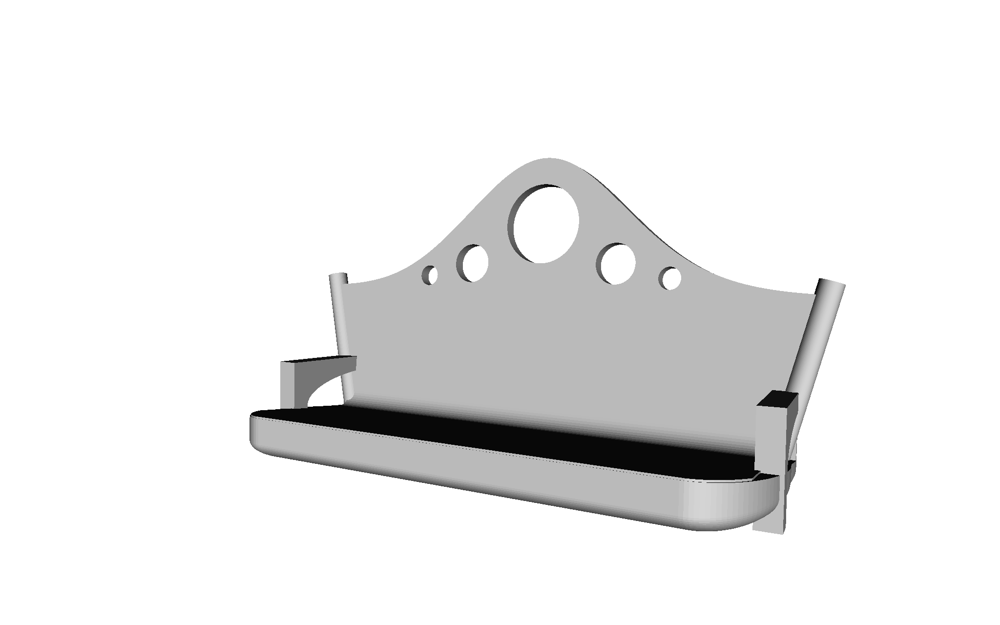

# #ParkBenchy

A new test for your 3D printer! This file tests the same things as the more famous benchy boat, but has the added benefit that nobody will ever try to sue you for using it.

## Font

The text in this model is rendered in the font Courgette, which is licensed under the [SIL Open Font License](SIL Open Font License.txt). This permissive license freely permits copying and use, as long as the license is included.

## License

This creation is licensed under the BSD License (3-clause).

* You can use this for any purpose, including commercial.
* You can distribute this however you want.
* You can make whatever changes you want to this.
* You can use this for any private purpose you want.
* The only requirement is that if you haven't substantially changed it, you have to keep it under the same license.
* You can't use the names of anybody who has contributed to the project without permission.

[Full details of license](LICENSE.md)
